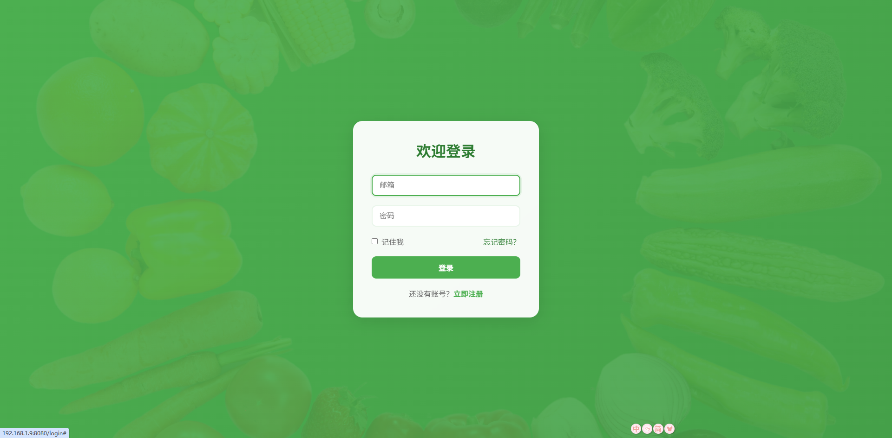
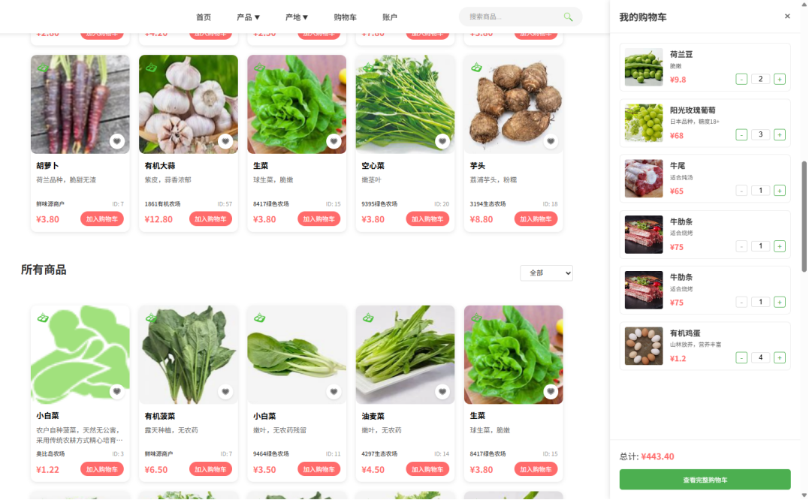
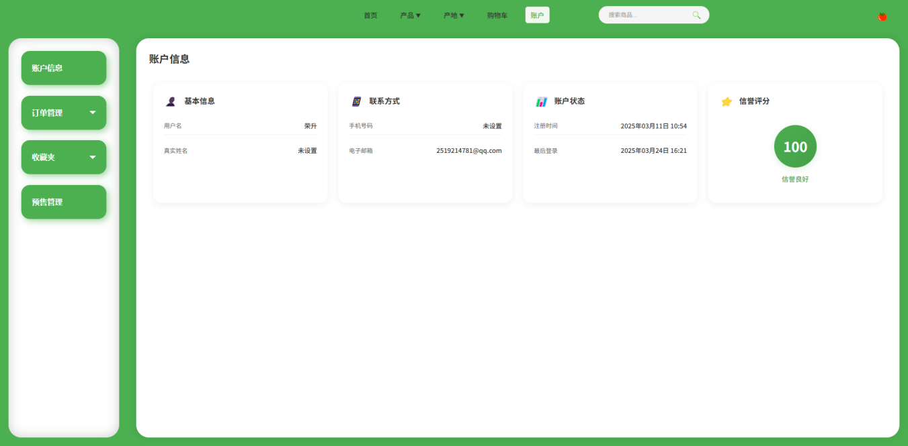
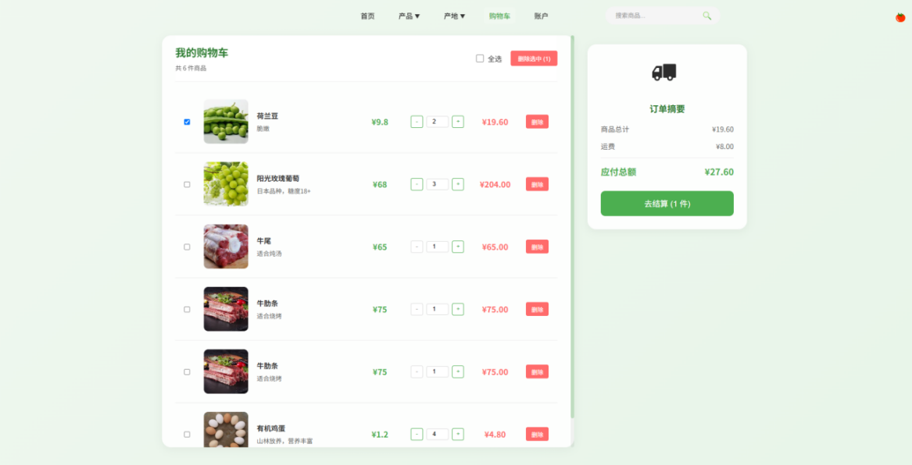
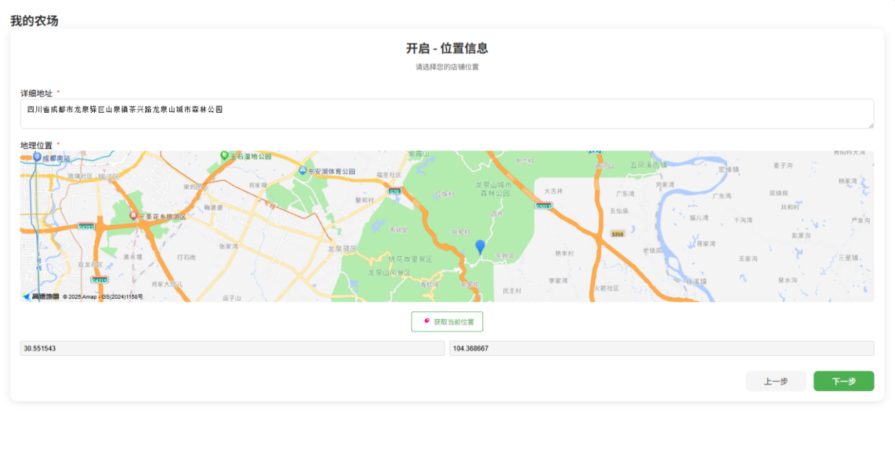
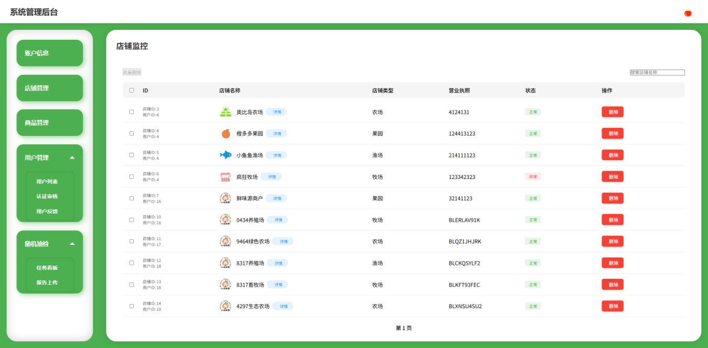
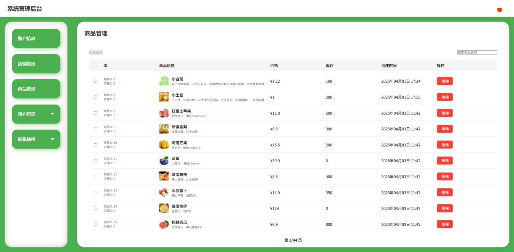
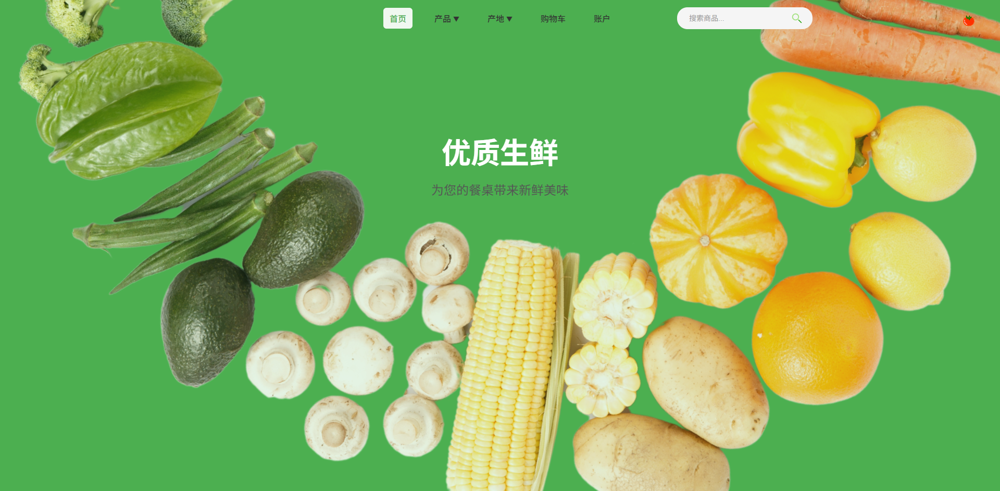

# 毕业设计项目：去中介化生鲜在线销售平台

> **项目定位**：本项目是本人大学阶段的最终毕业设计，旨在通过前后端分离的现代Web技术，打造一个安全、高效、体验优良的生鲜电商平台，实现农户与消费者的直连交易，提升供应链效率，保障商品质量。

---

## 一、项目总体概述

本平台聚焦于生鲜农产品的在线销售，采用“农户-消费者”直连模式，去除中间环节，提升农民收入、降低消费者成本。平台支持买家、卖家、管理员三类角色，分别对应商品浏览与购买、店铺与商品管理、平台监管与抽检等功能。系统通过多端适配、地图定位、加密通信、权限分离等手段，保障数据安全与用户体验。

- **目标用户**：农户（卖家）、普通消费者（买家）、平台管理员
- **核心功能**：商品浏览、购物车、订单支付、预售管理、店铺认证、商品抽检、用户反馈等
- **设计理念**：极致体验、数据安全、流程透明、角色分明

---

> **视频演示**：
>
> 

## 二、技术架构与技术栈详解

### 1. 前端架构

- **框架选型**：Vue 3 + Composition API，组件化开发，提升复用性与可维护性。
- **状态管理**：利用Vue的响应式系统，局部状态用`ref`/`reactive`，全局信息（如用户、Token）存储于`localStorage`/`sessionStorage`。
- **路由管理**：vue-router实现多角色页面跳转与权限隔离。
- **工程化**：模块化目录结构，API抽象、组件复用、样式分离，代码风格统一。

### 2. 关键技术实现

#### （1）接口加密与安全通信

- 登录、注册等敏感操作采用**前端动态密钥加密**，流程如下：
  - 前端通过`/keys/generate`接口获取密钥Key，存入Cookie。
  - 再通过`/keys/key`接口获取密钥值。
  - 使用`CryptoJS`库（见`login/key.js`）对用户数据（如密码）进行AES/CBC/PKCS7加密，生成加密数据和IV。
  - 加密后的数据、IV、Key一同发送到后端，后端用私钥解密，保障传输安全。
- 相关源码：
  - `serves/login/index.js`、`serves/login/iv.js`、`serves/login/key.js`

#### （2）API请求与拦截

- 所有接口统一封装于`serves/api.js`，基于axios实例，自动注入Token，响应拦截处理异常。
- 支持带/不带Token的灵活请求，便于登录、注册等场景。

#### （3）地图与多媒体集成

- 卖家创建店铺时，集成高德地图SDK，支持**GPS定位**、地图选点、逆地理编码，提升认证真实性。
- 多媒体支持：商品、店铺图片上传与预览，首页视频展示（`images/封面页面视频.mp4`）。

#### （4）组件化与UI/UX

- 所有页面均采用高度组件化设计，如`Nav.vue`（导航）、`CartPopup.vue`（购物车弹窗）、`ProductForm.vue`（商品表单）、`shop_step1/2/3.vue`（店铺创建分步表单）、`admin_nav_side.vue`（管理员侧边栏）等。
- 响应式布局，适配PC与移动端，交互细节丰富（如购物车动画、弹窗、进度条等）。

---

## 三、主要功能模块与页面

### 1. 登录与注册

- **加密登录**：用户输入邮箱、密码，前端加密后传输，保障安全。
- **多角色注册**：支持买家、卖家、管理员注册，管理员需输入专属验证码。
- **记住密码**：Cookie存储，自动填充。

### 2. 买家端

- **首页与商品浏览**：分类导航、商品封面、热销榜单、商品详情悬浮卡片。
- **购物车**：弹窗与独立页面双模式，支持数量调整、批量操作、库存校验。
- **订单与支付**：多地址管理、地图定位、预售进度可视化、电子订单凭证。
- **收藏夹**：商品/店铺收藏，降价/库存提醒。
- **售后与投诉**：订单评价、退换货、投诉反馈。

### 3. 卖家端

- **店铺管理**：首次登录需实名认证，上传身份证、营业执照、实景图片，地图定位。
- **商品管理**：批量上传、分类管理、库存预警、预售限额、质检状态标注。
- **订单处理**：订单状态流转、批量导出、物流单号管理。
- **预售管理**：作物生长日志、发货倒计时、预售转普通订单。
- **质检报告**：历史抽检记录、申诉、整改。

### 4. 管理员端

- **平台监管**：资质审核、店铺监控、商品管理、用户封禁。
- **商品抽检**：自动生成虚拟订单，抽检结果公示，异常店铺强制下架。
- **用户反馈**：投诉处理、站内信/邮件通知。

### 5. 首页与多媒体

- **首页视频**：`images/封面页面视频.mp4`，动态展示平台理念与功能。
- **封面设计**：美观大气，突出品牌形象。

---

## 四、关键技术亮点与创新点

### 1. 前端加密通信
- 动态密钥、AES加密，保障用户数据安全，防止中间人攻击。
- 密钥分步获取，前后端协同，安全性高。

### 2. 地图与定位
- 高德SDK深度集成，支持自动定位、手动选点、逆地理编码，提升认证与下单体验。

### 3. 购物车与订单流
- 购物车弹窗与页面联动，支持批量操作、库存校验、进度条反馈。
- 订单流程全链路可视化，预售商品有生长进度追踪。

### 4. 权限分离与多角色支持
- 路由与页面严格区分买家、卖家、管理员，权限隔离，防止越权访问。
- 管理员端支持商品抽检、用户封禁、投诉处理等高级功能。

### 5. 组件化与工程化
- 组件高度复用，样式与逻辑分离，易于维护与扩展。
- 代码风格统一，注释规范，接口抽象清晰。

---

## 五、个人能力体现

- **全栈思维**：前后端接口协同，安全机制设计，业务流程梳理。
- **工程化实践**：模块化目录、API抽象、自动化构建、代码规范。
- **UI/UX设计**：响应式布局、交互动效、细节打磨，用户体验优先。
- **性能优化**：组件懒加载、接口防抖、进度条反馈、错误处理完善。
- **创新能力**：前端加密、地图定位、预售进度、抽检机制等均为自主设计实现。

---

## 六、视频与图片展示

> **视频演示**：
>
> 

> **页面截图**：
>
> 
> 
> 
> 
> 
> 
> 
> 
> 

---

> **总结**：
>
> 本项目不仅实现了生鲜电商平台的全流程功能，更在安全、体验、工程化等方面做了大量创新与打磨。所有核心功能均为本人独立开发，代码规范、架构清晰，充分展现了本人对前端开发、全栈协作、用户体验与工程实践的深刻理解与掌控能力。