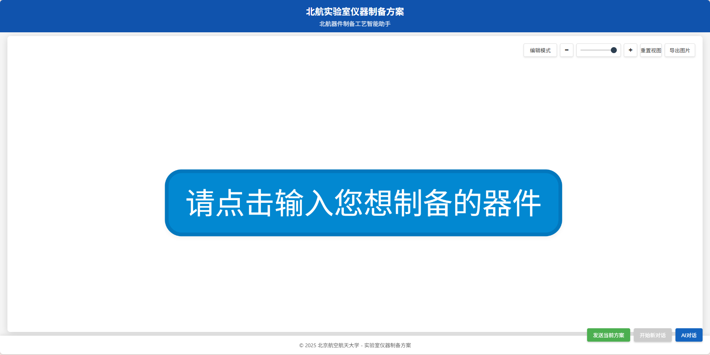
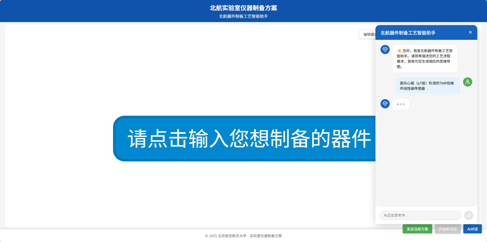
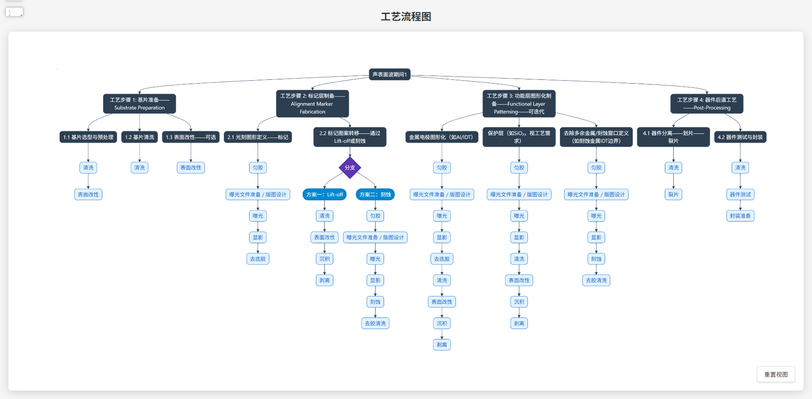

# React前端项目：北航实验室AI辅助制备系统

## 项目简介

这是我在大四实习期间，使用React框架独立开发的一个前端项目。该系统主要服务于北京航空航天大学的实验室，通过前端技术实现了AI辅助制备光刻机等精密设备的可视化交互系统。



## 技术亮点

### 1. React组件开发

- **组件化设计**
  - 采用Function Component + Hooks的现代React开发模式
  - 实现了多个可复用的高阶组件
  - 组件间通信采用Props + Refs + 自定义事件

- **状态管理**
  - 使用useState管理组件内状态
  - useEffect处理副作用和生命周期
  - useRef实现组件实例引用和DOM操作
  - useImperativeHandle暴露组件方法

### 2. 创新交互实现



#### 2.1 可拖拽AI对话框
```jsx
// 创新实现拖拽功能
const [isDragging, setIsDragging] = useState(false);
const [position, setPosition] = useState({ x: 0, y: 0 });

const handleMouseDown = (e) => {
  setIsDragging(true);
  setDragOffset({
    x: e.clientX - position.x,
    y: e.clientY - position.y
  });
};
```

#### 2.2 流程图可视化
```jsx
// Mermaid图表渲染与交互
const renderDiagram = async () => {
  const { svg } = await mermaid.render('diagram', chartData);
  // 自定义SVG交互行为
  addCustomBehaviors(svg);
};
```

### 2.2 流程图渲染



### 2.3 父组件跟踪


#### 2.4 动态表单系统
```jsx
// 动态生成表单
const ProcessForm = ({ processes }) => {
  const [currentStep, setCurrentStep] = useState(0);
  const [formData, setFormData] = useState({});
  
  // 表单状态管理与验证
  const handleSubmit = async (data) => {
    validateAndUpdateForm(data);
  };
};
```

### 3. CSS模块化与动画

```scss
// 模块化CSS示例
.dialogContainer {
  position: fixed;
  transform: translate(var(--x), var(--y));
  transition: transform 0.3s ease;
  
  &.dragging {
    cursor: move;
    user-select: none;
  }
}

// 自定义动画
@keyframes fadeIn {
  from { opacity: 0; }
  to { opacity: 1; }
}
```

### 4. 性能优化

- **React性能优化**
  - 使用React.memo避免不必要渲染
  - useMemo缓存计算结果
  - useCallback优化回调函数
  - 实现组件懒加载

- **交互性能**
  - 拖拽使用requestAnimationFrame
  - 防抖与节流处理
  - 大数据渲染优化

### 5. 工程化实践

```jsx
// 项目结构
src/
  ├─ components/        // 可复用组件
  │   ├─ ChatDialog/   // AI对话组件
  │   ├─ MermaidDiagram/ // 流程图组件
  │   └─ ProcessForm/  // 表单组件
  ├─ hooks/            // 自定义Hooks
  ├─ utils/            // 工具函数
  ├─ styles/           // 全局样式
  └─ pages/            // 页面组件
```

## 技术栈

- **核心框架**: React 18
- **UI开发**: CSS Modules + SCSS
- **图表渲染**: Mermaid.js
- **工程化**: Webpack + Babel
- **代码规范**: ESLint + Prettier

## 项目成果

1. **前端能力提升**
   - 深入理解React组件化开发
   - 掌握前端性能优化技巧
   - 提升CSS模块化开发能力

2. **工程化经验**
   - 规范的代码组织能力
   - 组件设计与抽象能力
   - 项目架构设计经验

3. **业务价值**
   - 提升实验室工作效率
   - 优化用户操作体验
   - 实现流程可视化

## 总结

通过这个项目，我不仅完整实践了React的各项特性，还在组件设计、状态管理、性能优化等方面获得了深入的理解。项目中的可拖拽对话框、流程图编辑器等功能的实现，展示了我对复杂交互功能的开发能力。
