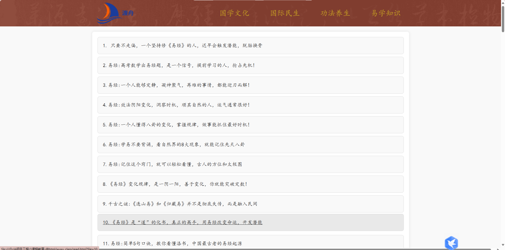
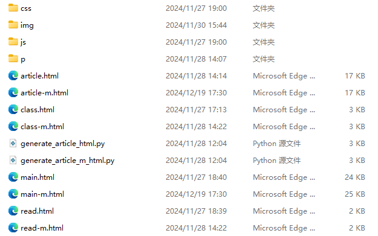

# 课程教育-纯html

## 项目简介
本项目为课程教育类网站，采用原生 HTML、CSS、JS 实现。该项目为大一阶段作品，旨在通过纯前端技术实现完整的课程教育平台，涵盖课程展示、文章阅读等多种功能。

---

## 主页与主要页面展示

主页设计简洁美观，内容分区明确，涵盖“国学文化”“国际民生”“功法养生”“易学知识”等多个板块，适合教育类内容的展示。


课程与文章内容以卡片形式排列，信息层级清晰，便于浏览。


---

## 响应式布局

本项目特别注重响应式设计，分别为 PC 端和移动端编写了独立页面和样式文件，保证了不同设备下的良好展示效果。

- PC端与移动端页面结构独立，样式自适应。
- 导航栏、卡片、内容区等元素在不同屏幕下自适应排布。

---

## 数据驱动的内容渲染

通过读取 txt 或其他数据文件，实现了图片与文本的动态渲染，极大提升了内容的可维护性和扩展性。

- 文本渲染效果：

  

- 文档标题提取与展示：

  

---

## 项目结构



```
1课程教育-静态html/
├── css/         # 样式文件
├── img/         # 图片资源
├── js/          # 脚本文件
├── main.html    # PC端首页
├── main-m.html  # 移动端首页
├── class.html   # PC端课程详情
├── class-m.html # 移动端课程详情
├── article.html # PC端文章列表
├── article-m.html # 移动端文章列表
├── read.html    # PC端文章详情
├── read-m.html  # 移动端文章详情
└── ...          # 其他资源
```

---

## 技术亮点与能力体现

- **原生 HTML/CSS/JS 实现**：无任何前端框架，纯手写代码，基础扎实。
- **响应式布局**：PC 与移动端自适应，用户体验优秀。
- **数据驱动渲染**：通过 JS 读取数据文件，实现内容与结构分离，便于维护。
- **页面结构清晰**：各页面分工明确，代码组织合理，易于扩展。
- **图片与文本结合**：图文穿插，内容丰富，视觉效果佳。

---

## 总结

本项目作为大一阶段的前端作品，充分展示了作者对 HTML、CSS、JS 的熟练掌握，尤其是在响应式布局、数据驱动渲染、页面结构设计等方面表现突出。项目不仅实现了多端适配，还通过动态内容渲染提升了网站的可维护性和用户体验，是前端基础能力的优秀展示。
