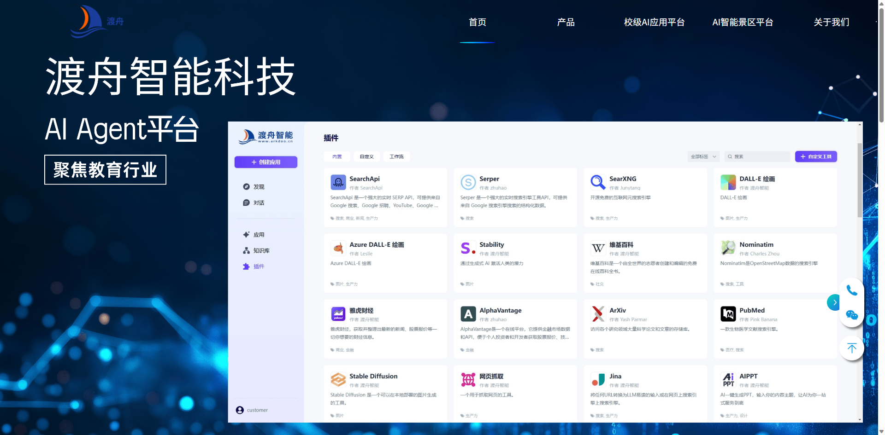
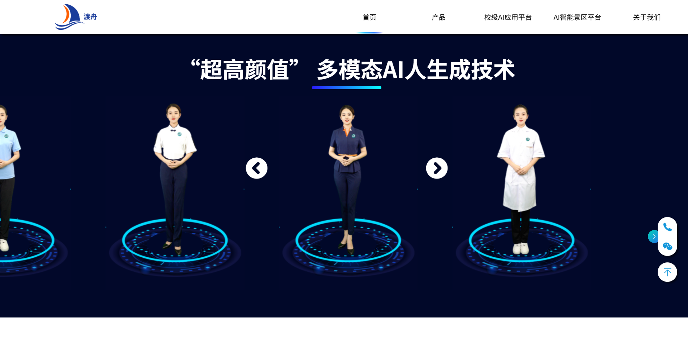
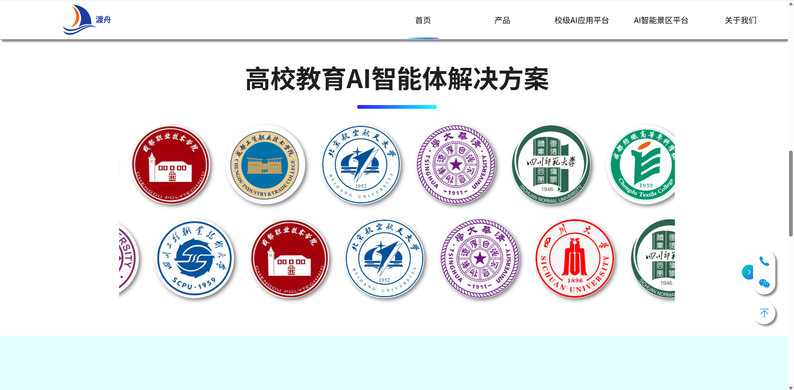
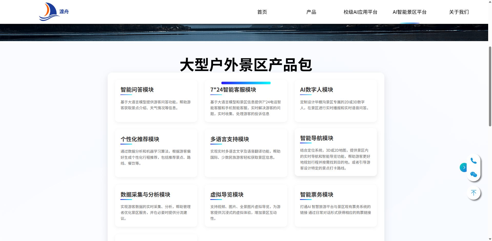
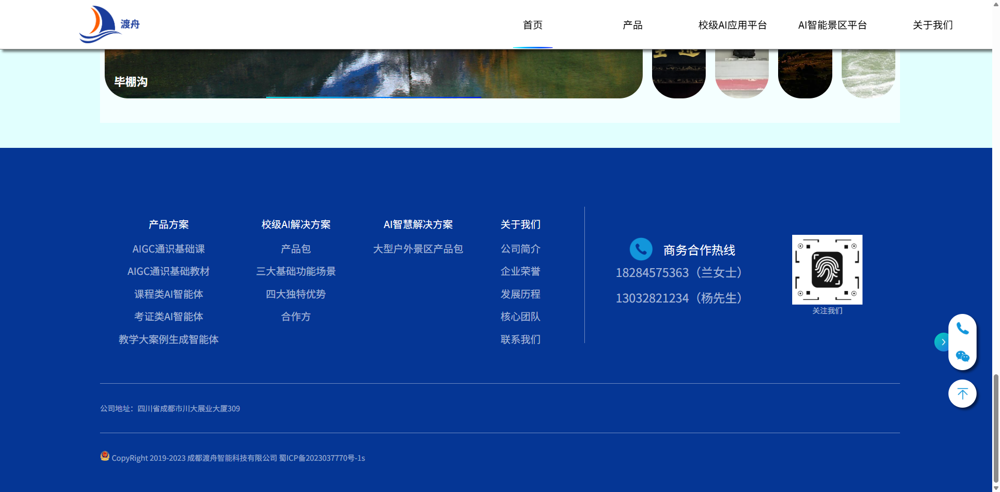

# 渡舟智能公司网站-纯html

> **大一前端作品 · 原生HTML/CSS/JS · 纯手敲代码 · 动画与交互设计**

---

## 项目简介

本项目为“渡舟智能”企业官网，采用原生 HTML、CSS、JavaScript 独立开发，所有代码均为本人手敲完成。项目聚焦于企业形象展示，涵盖首页、产品、解决方案、关于我们等多个板块，页面设计美观，动画丰富，交互体验流畅。

---

## 主页与动画效果展示

### 首页整体效果

- 首页采用响应式布局，整体风格科技感十足，色彩搭配清新。
- 顶部导航栏随页面滚动自动吸附，提升用户体验。

### 动画与交互亮点

#### 1. 数字人轮播图

- 纯 JS 实现的数字人轮播，支持自动与手动切换。
- 轮播动画流畅，图片切换带有渐变与滑动效果。
- 代码实现参考 `js/lb.js`，通过定时器与 DOM 操作实现自动轮播与左右按钮切换。

#### 2. 流动展示学校徽章

- 学校徽章采用横向滚动动画，展示合作高校。
- 使用 CSS 动画与 JS 控制，实现徽章的循环流动。

#### 3. 景区板块设计

- 景区板块采用卡片式布局，背景图片渐变切换。
- 卡片点击可切换展示内容，提升交互性。
- 相关动画逻辑见 `js/by.js`，通过事件监听与 class 切换实现卡片高亮。

#### 4. 页脚与顶部百叶窗动画

- 页脚信息丰富，包含公司信息、联系方式、备案号等。
- 顶部百叶窗动画采用 CSS3 渐变与过渡，提升页面层次感。

#### 5. GIF 动画背景

- 部分页面采用 GIF 作为动态背景，增强视觉冲击力。
- 动画与内容结合，营造科技氛围。

---

## 核心技术与源码亮点

- **纯原生 HTML/CSS/JS**：无任何框架依赖，所有交互与动画均为手写实现。
- **响应式布局**：采用弹性盒模型（Flex）、媒体查询等技术，适配不同分辨率，仅针对 PC 端优化。
- **导航栏吸顶与高亮**：`js/nav.js` 监听滚动事件，动态切换导航栏透明度与 z-index，实现吸顶与高亮。
- **轮播与动画**：`js/lb.js` 实现数字人轮播，`js/by.js` 实现景区卡片切换，`js/cb.js` 实现侧边栏交互与回到顶部。
- **渐变与入场动画**：通过检测页面高度与滚动位置，动态为标题、内容添加渐变与移动动画，提升页面动感。
- **DOM 操作与事件监听**：大量使用原生 JS 操作 DOM，绑定事件，实现复杂交互。
- **结构与样式分离**：HTML 结构清晰，CSS 独立管理，易于维护与扩展。

---

## 响应式与布局说明

- 采用弹性盒子（Flexbox）进行主布局，保证各板块自适应宽度。
- 主要针对 PC 端进行优化，页面宽度自适应主流显示器。
- 所有动画与交互均兼容主流浏览器。

---

## 个人成长与收获

- **代码能力提升**：每一行代码均为本人手敲，极大提升了 HTML、CSS、JS 基础与实战能力。
- **动画与交互设计**：深入理解了 DOM 操作、事件绑定、定时器、CSS3 动画等前端核心技术。
- **项目结构与规范**：学会了如何组织大型静态网站的结构，分离样式与逻辑，提升代码可维护性。
- **美学与用户体验**：注重页面美观与交互体验，力求每个细节都做到极致。

---

> 该项目是我前端学习的重要里程碑，充分展示了我对原生前端技术的掌握与热爱。
