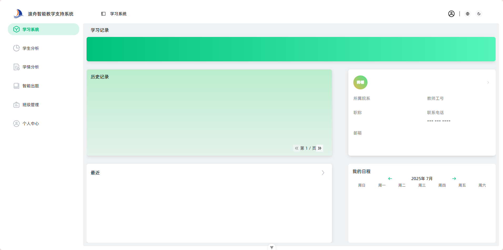
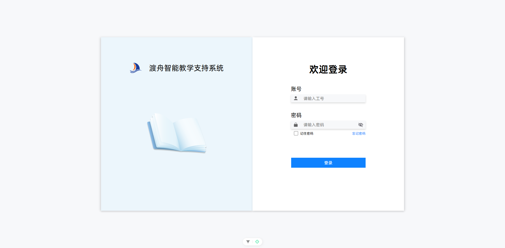
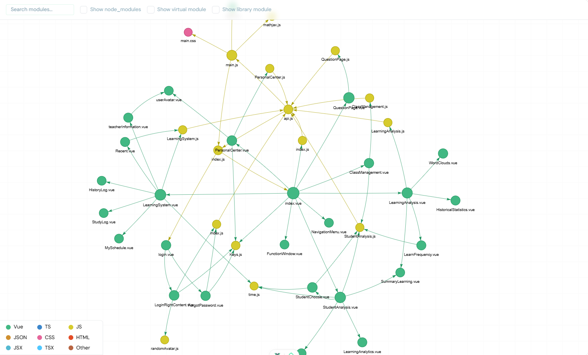

# 固体物理AI助学后台（teacher-vue框架PC端）

> **大三力作 · Vue3 + 组件化开发 · 响应式布局 · 纯手敲代码 · 企业级工程实践**

---

## 项目简介
本项目为“渡舟智能教学支持系统”教师端后台，基于Vue3框架开发，专为固体物理课程的智能助学与数据分析设计。系统集成了学习记录、学生分析、学情分析、智能出题、班级管理、个人中心等多个功能模块，界面美观，交互流畅，专为PC端优化。

---

## 主页与界面展示

由于公司数据隐私安全的原因，只展示外部样式。详情见4固体物理AI助学项目中的产品简介长图。

### 主页截图

- 左侧为主导航，右侧为各功能区动态切换。
- 响应式布局，适配主流显示器，所有布局均为手写实现。

### 登录页面

- 登录页采用左右分栏设计，简洁大方，支持密码找回。

### Vue技术栈结构图

- 展示了各 Vue 组件、JS模块之间的依赖关系，体现了良好的工程结构与模块解耦。

---

## 技术栈与工程架构

- **Vue3 + Composition API**：所有页面与功能均采用Vue3开发，组件化思想贯穿始终，代码结构清晰，易于维护与扩展。
- **Router路由管理**：`src/router/index.js` 采用 Vue Router 实现页面跳转与权限控制，支持登录与主界面分离。
- **响应式布局**：所有布局均采用Flex弹性盒模型，配合媒体查询，保证PC端自适应，体验极佳。
- **API统一管理**：所有后端接口统一封装于 `src/services/api.js`，通过axios实例管理请求与响应拦截，自动处理token与异常。
- **环境变量区分**：通过`.env`文件区分开发与生产环境，自动切换API地址，保证开发与上线安全高效。
- **版本控制**：全程使用Git进行版本管理，保证代码安全与团队协作。
- **安全加密**：登录、密码等敏感操作，前端使用RSA公钥加密，后端解密，详见 `src/utiles/Keys.js`。
- **Echarts可视化**：集成Echarts实现词云、饼图、折线图等多种可视化图表，动态展示学习数据。
- **PDF/Markdown/公式渲染**：智能出题模块支持Markdown与LaTeX数学公式渲染，自动生成PDF并内嵌展示。

---

## 关键功能与技术亮点

### 1. 智能出题（QuestionPage.vue）
- 多参数表单选择（题库、章节、知识点、题型数量等），参数通过v-model双向绑定，实时传递到后端。
- API交互：调用后端AI出题接口，异步获取题目数据，支持大数据量与超时处理。
- Markdown与数学公式渲染：后端返回题目为Markdown格式，前端自定义解析，集成MathJax高质量渲染。
- PDF导出与内嵌：题目内容自动生成PDF，支持“显示/隐藏答案”、“只看答案”等多种模式，PDF文件通过iframe内嵌展示。

### 2. 班级管理（ClassManagement.vue）
- 学生信息管理，支持多条件筛选、分页展示、状态切换（启用/冻结）。
- 状态变更API：一键切换学生状态，前端调用API实时更新，界面与数据同步。

### 3. 学情分析与Echarts可视化
- 数据统计与分析：学生学习次数、时长、知识点分布等多维度统计。
- Echarts集成：词云、饼图、折线图等多种可视化图表，动态展示学习数据。

### 4. 个人中心与信息安全
- 信息编辑：支持手机号、邮箱等信息的编辑与保存，自动校验与回显。
- 密码修改：RSA加密传输，修改后自动登出，保障账户安全。
- 头像生成：根据姓名自动生成渐变色头像，提升个性化体验。

### 5. 其他技术细节
- 时间处理：自定义时间戳转日期/时间字符串工具，保证数据展示一致性。
- MathJax指令：自定义Vue指令，自动渲染所有数学公式，兼容多种公式写法。
- 本地存储与缓存：部分数据采用localStorage/sessionStorage缓存，提升性能与体验。

---

## 代码能力与工程素养

- 每一行代码均为本人手敲，无任何脚手架生成，所有细节均精雕细琢。
- 组件化思想：所有功能均拆分为独立组件，复用性强，易于维护。
- 工程化实践：API管理、环境区分、版本控制、异常处理等均严格遵循企业级标准。
- 安全意识：前端加密、token管理、敏感信息保护等多重措施，保障数据安全。
- 美学与交互：界面设计美观，交互细腻，动画与反馈完善，用户体验极佳。

---

> **该项目是我前端成长的重要里程碑，充分展示了我对现代前端技术的理解与热爱。** 