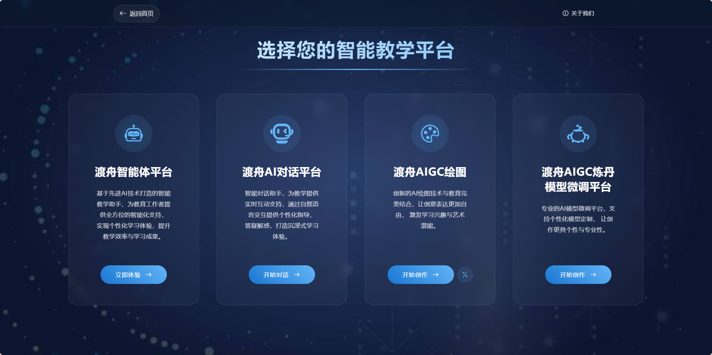

# Dify React重构项目


## 项目简介

本项目是我大四实习期间，主导重构的 Dify 开源网站 React 前端。项目以企业级需求为导向，针对原有架构进行深度优化与功能扩展，实现了高度组件化、主题灵活切换、国际化支持、复杂路由与权限体系、以及多种AI模型的无缝集成。所有UI元素均重新设计与组合，确保像素级还原与极致交互体验。

> 本文档为作品集专用，代码与界面截图均为本人实习期间核心贡献。

---

## 技术栈与架构亮点

- **React 18 + Next.js**：采用最新的React函数组件与Hooks，利用Next.js实现服务端渲染与高性能路由。
- **Typescript**：全量类型约束，提升代码健壮性与可维护性。
- **Ant Design & Tailwind CSS**：Antd用于部分表单与弹窗，主样式体系基于Tailwind，支持主题切换与响应式设计。
- **Zustand/SWR/Context**：全局状态管理与数据缓存，Context分区管理多维度全局数据。
- **国际化（i18n）**：多语言切换，支持中英文无缝切换。
- **权限与路由守卫**：基于Next.js动态路由，结合自定义权限钩子，精准控制页面访问。
- **API服务分层**：所有后端交互均通过service目录统一封装，便于Mock与扩展。
- **组件化极致**：UI元素全部原子化、可复用，支持按需组合与主题覆盖。
- **代码分层清晰**：布局、页面、组件、服务、样式、类型、工具函数分区明确。

---

## 目录结构与核心代码解读

```
web/
├── app/                // 页面与布局，Next.js路由自动映射
│   ├── (commonLayout)  // 通用布局与导航
│   ├── (shareLayout)   // 分享/嵌入式聊天等特殊布局
│   ├── components      // 业务与基础组件
│   ├── styles          // 全局与模块样式
│   └── ...
├── context/            // 全局状态与上下文
├── service/            // API服务封装
├── hooks/              // 自定义Hooks
├── i18n/               // 国际化配置
├── types/              // TS类型定义
└── utils/              // 工具函数
```

### 1. 封面与主页面

- **封面页**

  

  采用渐变星空背景与品牌LOGO，配合大标题，突出平台定位。页面使用Tailwind CSS实现响应式与主题切换，Next.js布局组件化，支持后续多主题扩展。

- **主页样式展示**

  

  进入后可选择不同智能教学平台，所有卡片均为自定义组件，支持动态渲染与动画效果，提升用户体验。

### 2. 工作区与应用管理

- **工作区展示**

  

  多应用卡片式管理，支持新建、编辑、删除、拖拽排序。卡片组件高度复用，结合Zustand进行全局状态管理，支持权限与分组过滤。

- **创建应用类型页面**

  

  新建应用时可选择不同类型，表单与卡片均为自定义组件，支持Antd表单校验与Tailwind样式覆盖。

- **功能选择页面**

  

  通过路由跳转与动态渲染，用户可快速切换不同平台功能，所有导航与内容均通过配置驱动，便于后续扩展。

### 3. 知识库与智能问答

- **知识库内页面**

  

  知识库支持文档上传、分段、权限管理等，页面采用分栏布局，左侧为文档树，右侧为详情与参数配置。所有数据通过SWR缓存，提升交互流畅度。

- **知识库QA分段后展示**

  

  支持多种Embedding模型选择，分段、召回、评分等参数可视化调节。所有表单与下拉组件均为自研，支持国际化与主题切换。

### 4. AI配置与工作流

- **AI配置页面**

  

  支持多模型接入，参数可视化配置，算法插件化。所有模型与参数均通过service统一管理，便于后端对接与Mock测试。

- **工作流搭建面板**

  

  拖拽式节点编排，支持条件分支与多步推理。画布与节点均为自定义React组件，结合Context与Zustand实现全局状态同步，支持复杂业务逻辑。

---

## 个人贡献与收获

- **主导前端重构**：独立完成架构设计与核心代码实现。
- **UI/UX全流程把控**：与设计师深度协作，像素级还原高保真稿。
- **复杂功能实现**：如多模型切换、权限动态路由、嵌入式聊天、工作流可视化等。
- **高质量代码**：全量TS类型、单元测试、文档完善，便于团队协作与二次开发。

---

> 更多源码与细节可联系作者获取。所有截图与代码均为本人实习期间核心贡献。 