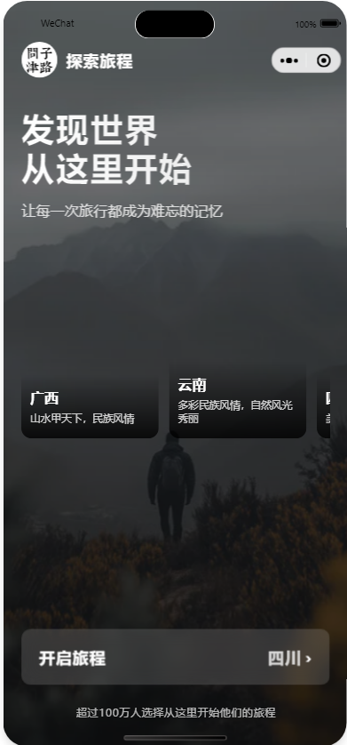
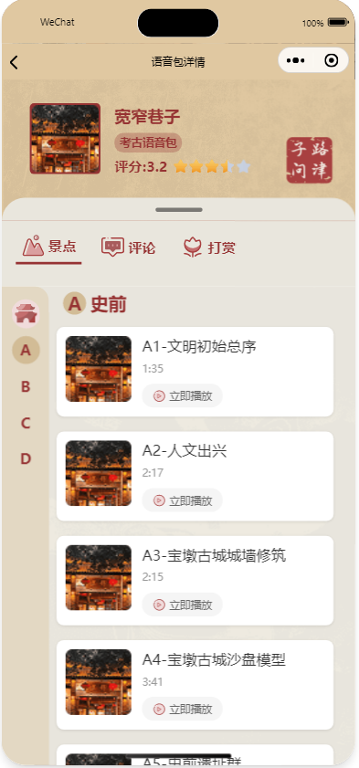
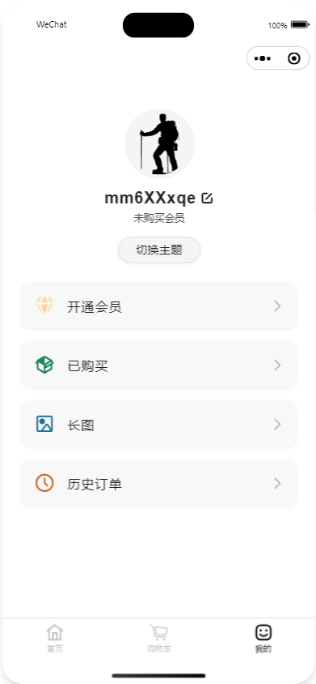
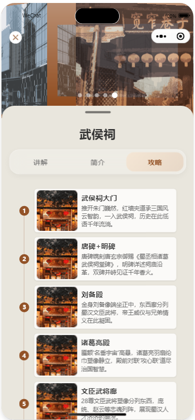
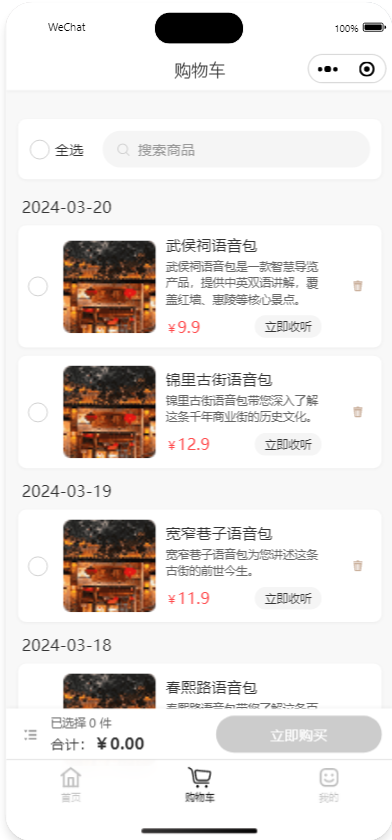

# AI智能旅游助手小程序

## 项目概述

这是一个基于微信小程序平台开发的智能旅游助手应用，旨在为用户提供一站式的旅游规划和导览服务。通过集成AI大模型、腾讯地图API和语音导览等功能，为用户打造个性化的旅游体验。



## 核心功能

### 1. AI智能规划
- 基于大模型的智能对话系统
- 个性化旅游路线推荐
- 智能行程时间规划
- 景点推荐系统


### 2. 景区导览系统
- 分类浏览景点信息
- 景区详情展示
- 智能路线规划
- 腾讯地图导航集成


### 3. 语音导览服务
- 专业讲解内容
- 景点语音包购买
- 文物详细介绍
- 历史文化解说



### 4. 个性化服务
- 用户中心
- 购物车系统
- 订单管理
- 收藏功能



## 技术栈详解

### 1. 前端架构
- 采用**微信小程序原生开发**框架
- 使用**TypeScript**进行开发，提供类型安全
- 实现**组件化**开发，提高代码复用性
- 使用**WXSS**实现响应式布局

### 2. 页面结构设计
```
miniprogram/
  ├── pages/
  │   ├── initiate/          # 启动页
  │   ├── ScenicSpot_guide/  # 景点导览
  │   ├── ScenicSpot_detail/ # 景点详情
  │   └── ScenicSpot_list/   # 语音包列表
  └── components/            # 公共组件
```

### 3. 核心技术实现

#### 3.1 动画效果
- 使用CSS3实现流畅的转场动画
- 自定义动画类控制页面切换效果
- 实现3D轮播图效果

```css
.swiper-wrapper {
    transform-style: preserve-3d;
    transition: transform 0.6s ease-out;
}
```

#### 3.2 布局技术
- 采用Flex弹性布局
- 使用Grid网格布局
- 响应式设计适配不同机型
- 自定义导航栏实现

```css
.content-main {
    display: flex;
    flex-direction: column;
    min-height: 100vh;
}
```

#### 3.3 状态管理
- 使用TypeScript接口定义数据结构
- 实现页面间数据通信
- 本地存储管理用户数据

```typescript
interface IPageData {
    mainAnimationClass: string;
    currentTab: number;
    // ... 其他数据结构
}
```

#### 3.4 组件化开发
- 封装通用UI组件
- 实现组件间通信
- 自定义事件处理

```typescript
Component({
    properties: {
        guideList: Array,
        // ... 组件属性
    },
    methods: {
        // ... 组件方法
    }
})
```

## 项目亮点

1. **优秀的用户体验**
   - 流畅的页面过渡动画
   - 精心设计的UI界面
   - 直观的操作流程

2. **创新的功能设计**
   - AI智能规划集成
   - 3D景点展示
   - 语音导览服务

3. **高质量的代码实现**
   - TypeScript类型安全
   - 组件化架构
   - 代码复用性高

4. **完善的业务逻辑**
   - 用户行为分析
   - 个性化推荐
   - 支付功能集成

## 项目收获

1. 深入理解微信小程序开发流程
2. 掌握TypeScript在实际项目中的应用
3. 提升组件化开发能力
4. 增强项目架构设计能力
5. 提高用户体验设计水平

## 项目展示


 