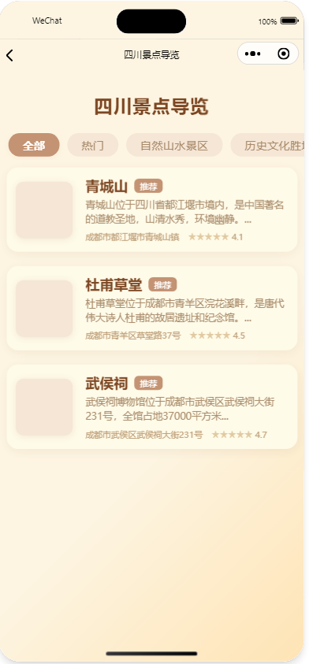

# AI智能旅游助手小程序

## 项目概述

这是一个基于微信小程序平台开发的智能旅游助手应用，旨在为用户提供全方位的旅游规划和导览服务。项目利用AI大模型技术，结合腾讯地图服务，为用户打造个性化的旅游体验。


## 核心功能

### 1. AI智能规划
- 基于大模型的智能旅游规划
- 个性化行程定制
- 智能景点推荐
- 旅游时间规划助手


### 2. 景区导览系统
- 分类浏览景点信息
- 景区详情展示
- 智能路线规划
- 腾讯地图导航集成



### 3. 语音导览服务
- 景点语音讲解
- 文物知识介绍
- 历史文化解说
- 专业讲解购买


### 4. 个性化服务
- 用户中心
- 购物车系统
- 订单管理
- 收藏功能


## 技术栈详解

### 1. 前端架构
- 微信小程序原生开发
- TypeScript 语言
- WXSS 样式处理
- Component 组件化开发

### 2. 页面布局技术
```typescript
// 创新性布局方案
interface IPageData {
  mainAnimationClass: string;
  images: string[];
  currentIndex: number;
  rotateY: number;
  radius: number;
  translateZ: number;
}
```

### 3. 动画效果
- CSS3 高级动画
- Transform 3D转换
- Transition 过渡效果
- 自定义动画帧

```css
.spot-card {
  animation: fade-slide-up 0.6s cubic-bezier(0.23, 1, 0.32, 1) both;
  transition: box-shadow 0.2s;
}

@keyframes fade-slide-up {
  0% {
    opacity: 0;
    transform: translateY(60rpx);
  }
  100% {
    opacity: 1;
    transform: translateY(0);
  }
}
```

### 4. 交互设计
- 手势滑动控制
- 3D旋转画廊
- 沉浸式页面切换
- 流畅的动画过渡

```typescript
handleTouchMove(e: any) {
  const touchEndX = e.touches[0].clientX;
  const moveX = touchEndX - this.data.touchStartX;
  const tempRotation = this.data.totalRotation + (moveX / 2);
  this.setData({
    rotateY: tempRotation
  });
}
```

### 5. 组件化开发
- 自定义组件封装
- 组件间通信
- 生命周期管理
- 状态管理设计

```json
{
  "usingComponents": {
    "guide-content": "/components/scenic-spot-components/guide-content/guide-content",
    "intro-content": "/components/scenic-spot-components/intro-content/intro-content",
    "strategy-content": "/components/scenic-spot-components/strategy-content/strategy-content"
  }
}
```

### 6. 样式设计
- 响应式布局
- Flex弹性布局
- Grid网格系统
- 主题色系统

```css
.content-main {
  display: flex;
  flex-direction: column;
  background: linear-gradient(135deg, #fdf5e2 60%, #ffe4b5 100%);
}
```

## 项目亮点

1. **创新的UI设计**
   - 3D旋转画廊展示
   - 流畅的动画过渡
   - 精美的视觉效果
   - 直观的操作体验

2. **高性能实现**
   - 页面按需加载
   - 图片懒加载优化
   - 动画性能优化
   - 内存管理优化

3. **代码质量**
   - TypeScript类型检查
   - 组件化模块设计
   - 清晰的代码结构
   - 规范的命名约定

4. **用户体验**
   - 沉浸式界面设计
   - 智能推荐算法
   - 便捷的操作流程
   - 个性化定制服务

## 技术成果

1. 实现了基于微信小程序的完整旅游服务平台
2. 开发了创新的3D旋转画廊展示组件
3. 设计了高效的状态管理方案
4. 构建了灵活的组件化架构
5. 优化了复杂动画性能

## 项目收获

1. 深入理解微信小程序开发流程
2. 掌握TypeScript在实际项目中的应用
3. 提升组件化开发和模块化设计能力
4. 积累复杂业务场景解决方案
5. 增强项目架构设计能力 