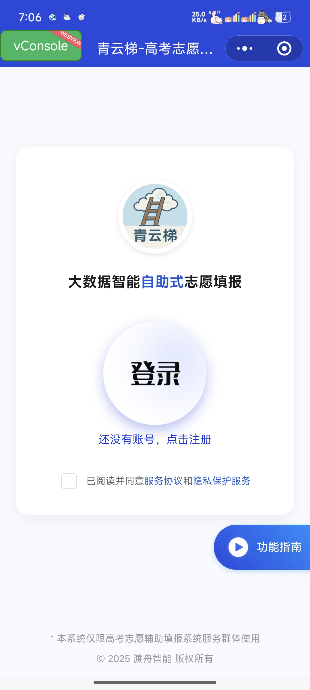
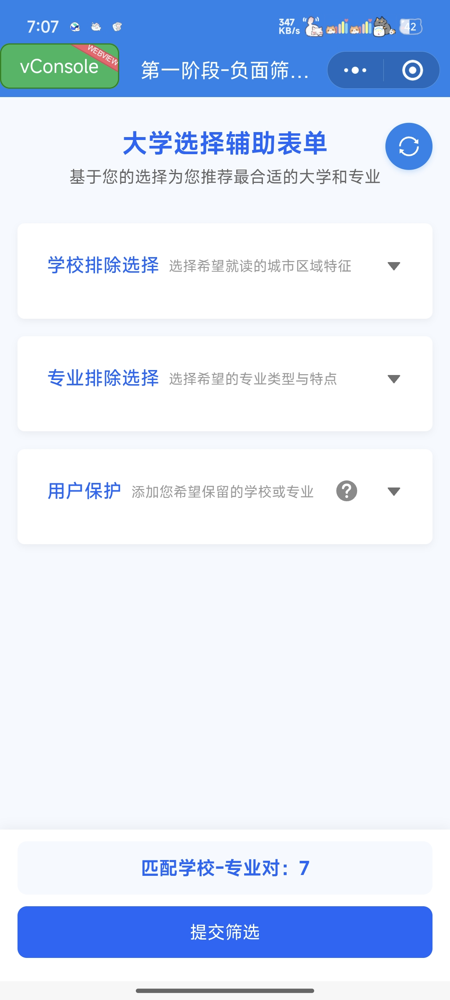
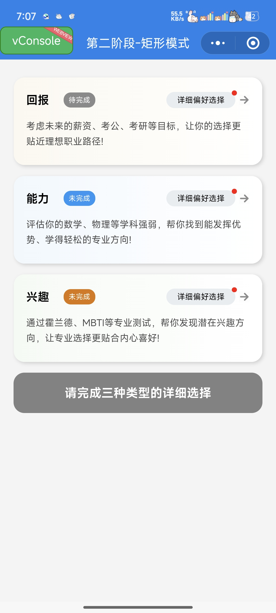
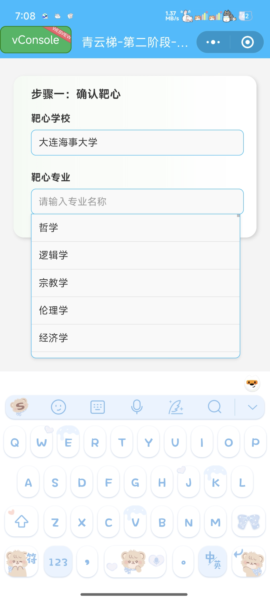
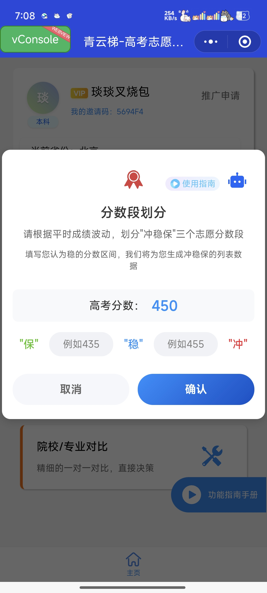

# 青云梯 - AI辅助高考志愿填报小程序

## 项目简介

青云梯是一款基于微信小程序平台开发的智能高考志愿填报辅助系统。项目采用现代化的前端技术栈，结合AI算法，为高考考生提供精准的志愿填报建议。该项目是我在大四实习期间完成的重要作品，体现了我在前端开发方面的专业技能和项目经验。



## 技术栈

- 框架：微信小程序原生框架
- 语言：TypeScript
- 样式：WXSS + Flex布局
- 状态管理：小程序原生数据管理
- UI组件：自定义组件 + 微信原生组件
- 动画：CSS3 + 微信动画API
- 网络请求：Promise + wx.request封装

## 核心功能

### 1. 智能分步引导填报系统

项目采用三阶段填报模式，每个阶段都有清晰的用户引导：



#### 第一阶段：学校初筛
- 基础信息收集
- 智能预筛选
- 个性化偏好设置

#### 第二阶段：精准定位
系统提供两种模式：

1. 矩形模式（探索模式）


2. 圆形模式（定向模式）


#### 第三阶段：AI精调


### 2. 专业的UI/UX设计

项目在UI设计上采用了现代化的设计理念：

- 扁平化设计风格
- 柔和的色彩搭配
- 流畅的动画过渡
- 清晰的视觉层级
- 直观的操作反馈

## 技术亮点

### 1. 组件化开发
```typescript
// 示例：矩形选择组件
Component({
  properties: {
    mode: {
      type: String,
      value: 'rectangle'
    }
  },
  data: {
    activeIndex: 0
  },
  methods: {
    handleSelect() {
      // 处理选择逻辑
    }
  }
})
```

### 2. 响应式布局
```css
/* 弹性布局示例 */
.container {
  display: flex;
  flex-direction: column;
  justify-content: space-between;
  min-height: 100vh;
}

.content {
  flex: 1;
  padding: 20rpx;
}
```

### 3. 状态管理
```typescript
// 全局状态管理示例
interface GlobalData {
  userInfo: UserInfo;
  selectedSchools: School[];
  preferences: UserPreferences;
}

class AppService {
  private static instance: AppService;
  private globalData: GlobalData;

  static getInstance() {
    if (!AppService.instance) {
      AppService.instance = new AppService();
    }
    return AppService.instance;
  }
}
```

### 4. 自定义组件封装
```typescript
// 权重调节组件示例
Component({
  properties: {
    min: { type: Number, value: 0 },
    max: { type: Number, value: 100 },
    value: { type: Number, value: 50 }
  },
  methods: {
    onSliderChange(e: WechatMiniprogram.SliderChange) {
      this.triggerEvent('change', { value: e.detail.value });
    }
  }
})
```

## 项目亮点

1. **模块化设计**：采用分包加载，优化小程序体积和加载速度
2. **TypeScript支持**：使用TypeScript提供类型安全和更好的开发体验
3. **自定义组件**：封装了大量可复用的业务组件
4. **性能优化**：
   - 采用分包加载
   - 图片懒加载
   - 数据缓存优化
   - 防抖节流处理

## 项目收获

1. 深入理解微信小程序开发流程和技术特点
2. 掌握TypeScript在实际项目中的应用
3. 提升组件化开发和模块化设计能力
4. 增强项目架构设计和性能优化能力
5. 提高用户体验和交互设计能力

## 项目难点解决

1. **性能优化**：通过分包加载、数据预加载等策略优化加载速度
2. **状态管理**：采用全局状态管理方案，解决跨页面数据共享问题
3. **组件复用**：设计可复用的业务组件，提高开发效率
4. **动画效果**：结合CSS3和微信动画API实现流畅的交互动画

## 项目总结

青云梯项目是一个综合性的微信小程序项目，涉及到前端开发的多个领域。通过这个项目，我不仅提升了技术能力，也深入理解了产品设计和用户体验的重要性。项目中采用的模块化设计、TypeScript开发、组件化封装等技术方案，都为我后续的前端开发工作打下了良好的基础。 